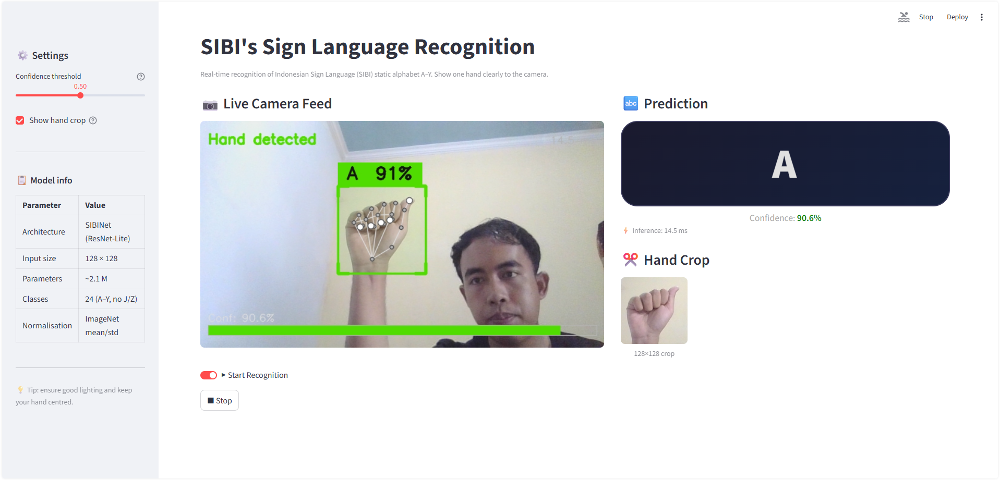
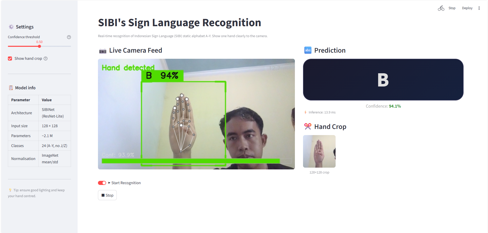
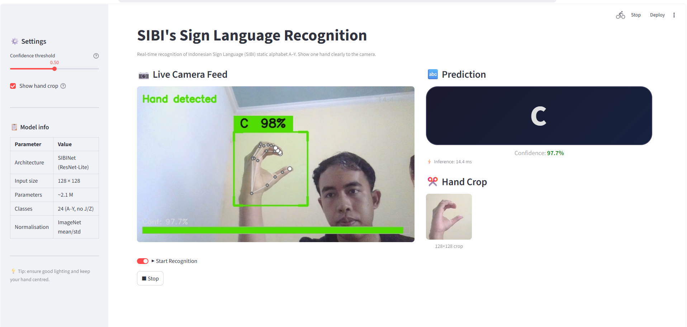
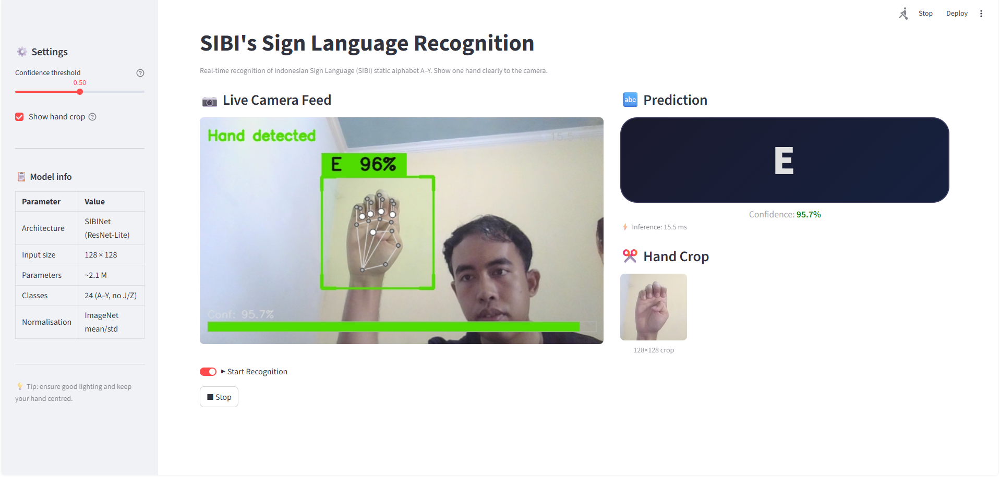
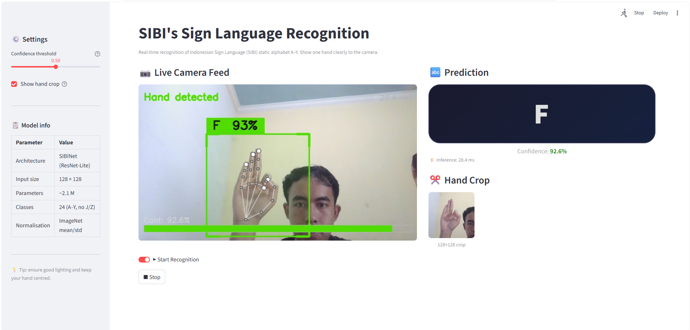
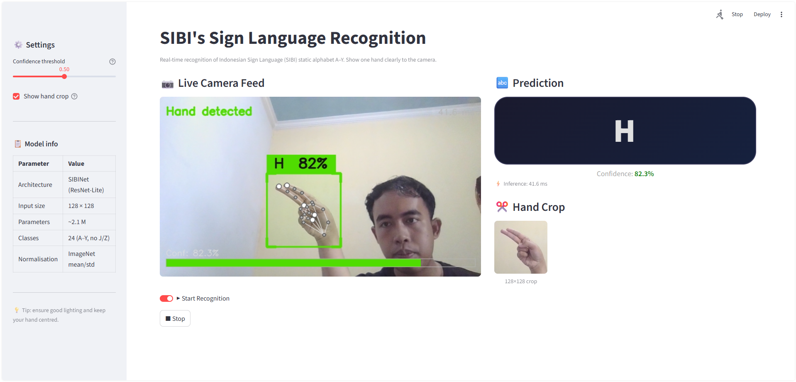
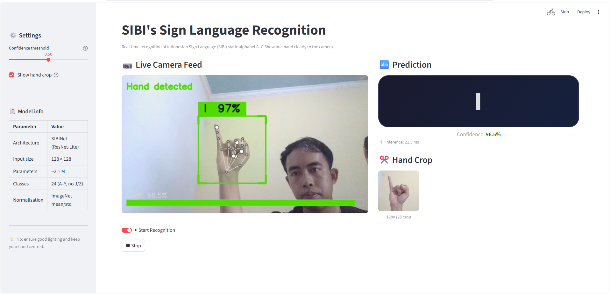
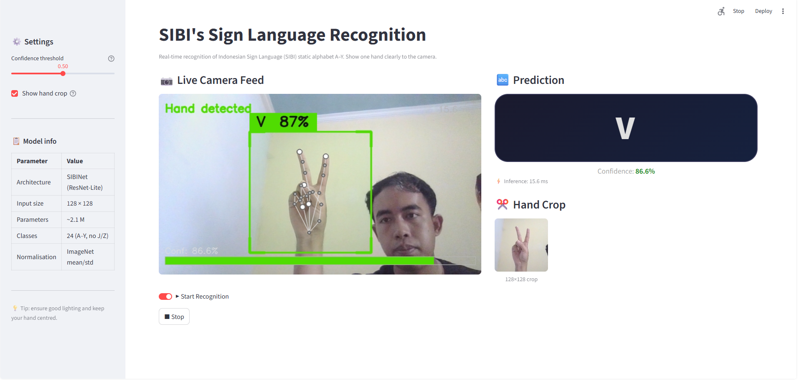
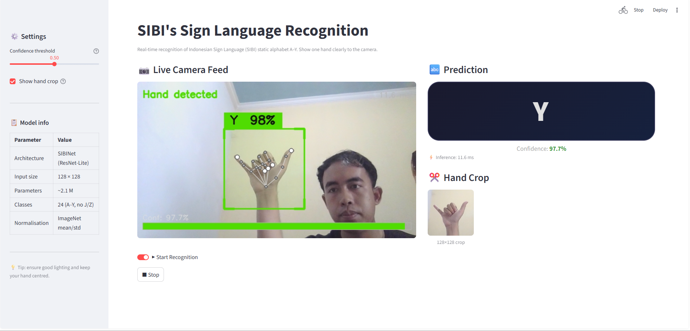
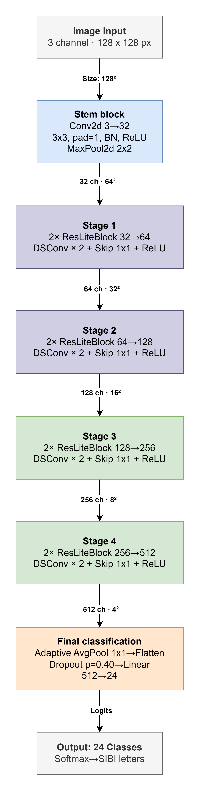

# SIBI's AI: Real-Time Sign Language Recognition


[SIBI dataset](https://www.kaggle.com/datasets/alvinbintang/sibi-dataset)

**SIBI's AI** is a real-time computer vision application designed to recognize the Indonesian Sign Language (Sistem Isyarat Bahasa Indonesia / SIBI) alphabet. It accurately classifies static alphabet hand signs from A to Y (excluding dynamic signs like J and Z) directly from a webcam feed.

---

## Features

* **Real-Time Inference:** Smooth webcam processing optimized for local hardware, ensuring zero-latency prediction.
* **Dynamic Hand Cropping:** Uses skeletal landmarks to dynamically track, pad, and crop the user's hand regardless of the background.
* **High Accuracy:** Custom-trained CNN achieving ~99% accuracy on the validation dataset.
* **Interactive UI:** Clean and responsive local web interface powered by Streamlit.

---

## How to Run Locally

This project uses `uv` for extremely fast Python package management and environment isolation.

### Prerequisites
* Python 3.10.
* Web camera.
* [uv](https://github.com/astral-sh/uv) installed on your system.

### Installation & Execution

1. **Clone the repository:**
   ```bash
   git clone https://github.com/Alfian-DA-ML/SIBI-s-AI.git
   cd SIBI_AI
   ```

2. **Sync the environment:**
   This command will automatically create a virtual environment (`.venv`) and install all required dependencies listed in the `uv.lock` or `pyproject.toml` file.
   ```bash
   uv sync
   ```

3. **Activate the virtual environment:**
   * **Windows:**
     ```bash
     .venv\Scripts\activate
     ```
   * **Linux/macOS:**
     ```bash
     source .venv/bin/activate
     ```

4. **Run the application:**
   Launch the local Streamlit server using `uv`:
   ```bash
   uv run streamlit run app.py
   ```

The application will automatically open in your default web browser at `http://localhost:8501`. Ensure your webcam is not being used by another application.

---

## Model Recognition Samples

| Sign A | Sign B | Sign C | Sign E | Sign F |
| :---: | :---: | :---: | :---: | :---: |
|  |  |  |  |  |

| Sign H | Sign I | Sign V | Sign W | Sign Y |
| :---: | :---: | :---: | :---: | :---: |
|  |  |  |  |  |

---

## How It Works (The Pipeline)

The system operates on a continuous loop, processing video frames through two main stages: Region of Interest (ROI) extraction and Deep Learning classification.



1. **Webcam Capture:** Grabs live frames via OpenCV directly from your local machine.
2. **Hand Detection:** MediaPipe HandLandmarker extracts 21 3D hand landmarks.
3. **Square Crop & Padding:** Calculates a bounding box around the landmarks, applies a 25% padding, and crops a square image to prevent distortion.
4. **Preprocessing:** Resizes the crop to 128x128 pixels and applies ImageNet normalization.
5. **SIBINet Inference:** The processed tensor is fed into the custom CNN to predict the SIBI letter and confidence score.

---

## Model Architecture: SIBINet

At the core of SIBI's AI is **SIBINet**, a custom ResNet-style lightweight CNN designed from scratch to balance high accuracy with low computational cost. 


* **Architecture Style:** ResNet-Lite
* **Input Size:** 128x128 RGB
* **Core Blocks:** Utilizes Depthwise Separable Convolutions (DSConv) inside custom ResLiteBlock structures to drastically reduce the parameter count (~2.1M parameters).
* **Output:** 24 classes (A-Y, without J/Z).
* **Performance:** Capable of running single-digit millisecond inferences on standard CPUs and GPUs.
